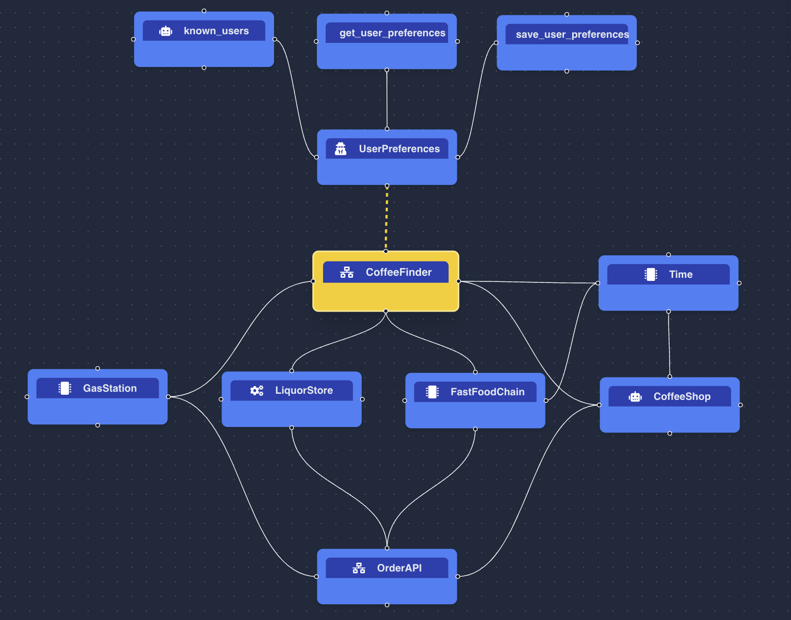
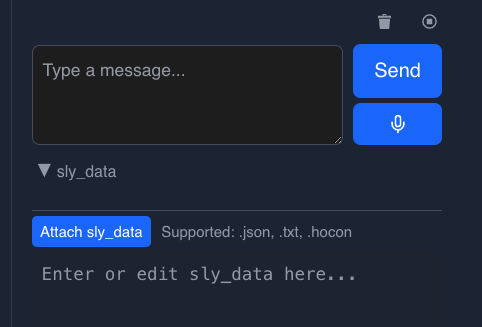

# Coffee Finder Advanced

This agent network is an advanced version of the Coffee Finder example.
It can:
* check the current time (can be overridden by the user)
* look for coffee options at that time of the day
* place orders on behalf of the user
* remember user preferences like favorite shop or usual order

It's good for testing:

* how multiple agents can provide the same service
* how to leverage AAOSA instructions to disambiguate
* how to ask for more information when needed, like a username
* how to call a CodedTool
* how to use sly_data to pass information to CodedTools
* how to learn and remember facts like user preferences

## File

[coffee_finder_advanced.hocon](../../../registries/basic/coffee_finder_advanced.hocon)

## Description

Coffee Finder Advanced is an agent network that can suggest options for coffee locations
based on the time of day, place orders on behalf of the user and remember user preferences.
Here is what it looks like:



## Tools

Coffee Finder Advanced uses 2 simple tools:
* OrderAPI, that can be called by the 4 shops
* Time, that's only used by CoffeeShop and FastFoodChain, as well as CoffeeFinder.
The other 2 shops are open 24/7, so they don't need to use Time.

Check their code in the [CodedTools](../../../coded_tools/basic/coffee_finder_advanced) folder.
See for instance how [TimeTool](../../../coded_tools/basic/coffee_finder_advanced/time_tool.py) is implemented:
* no args
* first checks if `sly_data` contains a `time` key, and uses its value if present
* otherwise, uses the current time

Remember, `sly_data` is NOT visible in the chat, but it's passed to the CodedTools that can use it like any
regular dictionary argument.

It also uses "memory" to remember user preferences like favorite shop or usual order.
Check the `UserPreferences` agent and the tools it's calling for more info about
how to gather and persist facts.

## Example conversations

### Using current time

Let's assume current time is 8 am.

```text
Human:
Where can I get coffee?

AI:
You can get coffee at the following places:

Bob's Coffee Shop
Henry's Fast Food
Joe's Gas Station
All of these locations are currently available to serve coffee.
If you'd like to place an order, please specify your choice and any preferences.
```

Notice how Coffee Finder tells us these places are currently available, because they checked the time.
We can place an order:

```text
Human:
Get me black coffee from Henry's

AI:
To place your order for a black coffee from Henry's Fast Food, I need your name.
Could you please provide your name to proceed?
```

Coffee Finder is following-up with a question, because it's needed to place the order.
Let's provide it with a name:
```text
Human:
Mike

AI:
Your order for a black coffee under the name Mike has been placed successfully at Henry's Fast Food.
Order details:
 * Item: Black coffee
 * Name: Mike
* Order ID: 201
Let me know if you need anything else!
```
### Overriding the current time in sly_data

Pass `sly_data` with your message to override the current time in the Time tool.
`sly_data` is just a dictionary:
```
{"time": "1 am"}
```

In the NSFlow UI, you can pass `sly_data` using the `sly_data` field under the `Message` field:



Let's see if the `Time` tool picks it up:

```text
Human:
message: Where can I get coffee?
sly_data: {"time": "1 am"}

AI:
You can get coffee at Joe's Gas Station at any time.
Other places like Bob's Coffee Shop and Henry's Fast Food are currently closed
and can't assist with coffee now.
Would you like to place a coffee order from Joe's Gas Station?
 If so, please specify your order.
```

Coffee Finder considers the time to be 1 am, and tells us some places are closed.

When can check the time by asking for it:
```text
Human:
message: What time is it?
sly_data: {"time": "1 am"}

AI:
It is 1 am. Let me know if you need anything else!
```
Coffee Finder uses its `Time` tool and gives us the time.

Let's ty to order from a place that's closed:
```text
Human:
message: Get me black coffee from Bob's Coffee Shop
sly_data: {"time": "1 am"}

AI:
Bob's Coffee Shop is currently closed and only accepts orders between 7 am and 6 pm.
If you want coffee right now (it’s 1 am), would you like to order from Joe's Gas Station instead?
Let me know if you'd like to proceed with another option.
```

Good, it doesn't place the order because Bob's Coffee Shop is closed.
Let's order from Joe's Gas Station instead, as suggested:

```text
Human:
message: ok, order from Joe's instead
sly_data: {"time": "1 am"}

AI:
To place a black coffee order from Joe's Gas Station, I need your name.
Could you please provide your name so I can complete the order?
```
Providing a name:
```text
Human:
message: Mike
sly_data: {"time": "1 am"}

AI:
Your black coffee has been ordered successfully for Mike at Joe's Gas Station.

Order ID: 301
Details: Black coffee for Mike

Let me know if you need anything else!
```

### Memorizing user preferences

Let's place more orders to see if Coffee Finder remembers user preferences.
Let's set the time to 8 am again:

```text
Human:
message: Liz here. Get me a cappuccino from Bob's Coffee Shop
sly_data: {"time": "8 am"}

AI:
Your order has been placed at Bob's Coffee Shop.

Order ID: 101
Details: Cappuccino for Liz

Let me know if you need anything else!
```

Now let's reload or restart the server, and see if Coffee Finder remembers our preference:

```text
Human:
message: Hey, it's Liz. Get me the same as usual please.
sly_data: {"time": "8 am"}

AI:
Liz, your usual order has been placed: 1 cappuccino from Bob's Coffee Shop.
Order ID: 101

Let me know if you need anything else!
```

You can check what Coffee Finder has memorized in the `TopicMemory.json` file:

```json
{
  "Mike": "[2025-09-09 16:22:27] Prefers black coffee from Henry's Fast Food.\n[2025-09-09 16:23:37] Prefers black coffee from Joe's Gas Station.",
  "Liz": "[2025-09-09 16:25:23] Liz ordered a cappuccino from Bob's Coffee Shop.\n[2025-09-09 16:28:47] Liz's usual coffee order is a cappuccino from Bob's Coffee Shop.\n[2025-09-09 16:28:56] Liz ordered a cappuccino from Bob's Coffee Shop."
}
```
