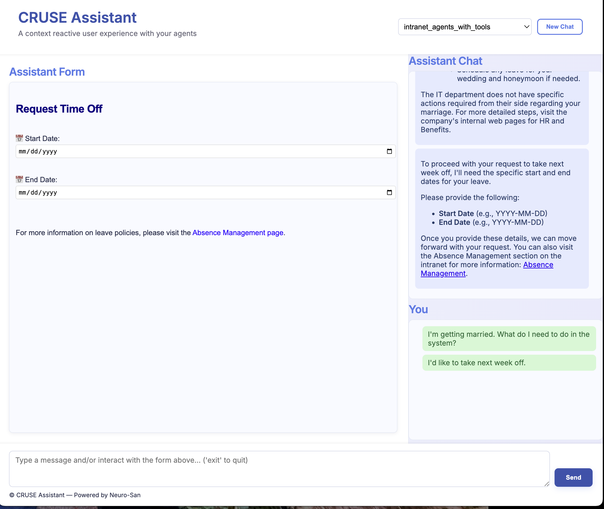
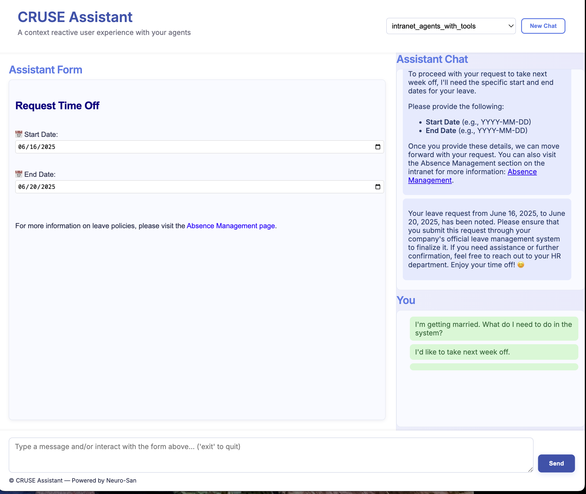
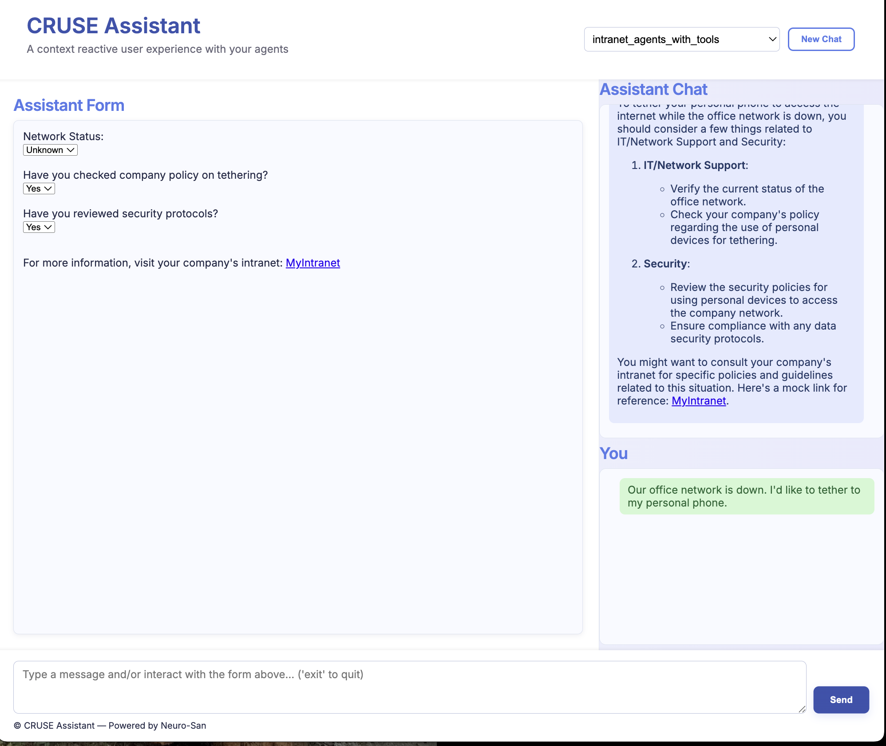
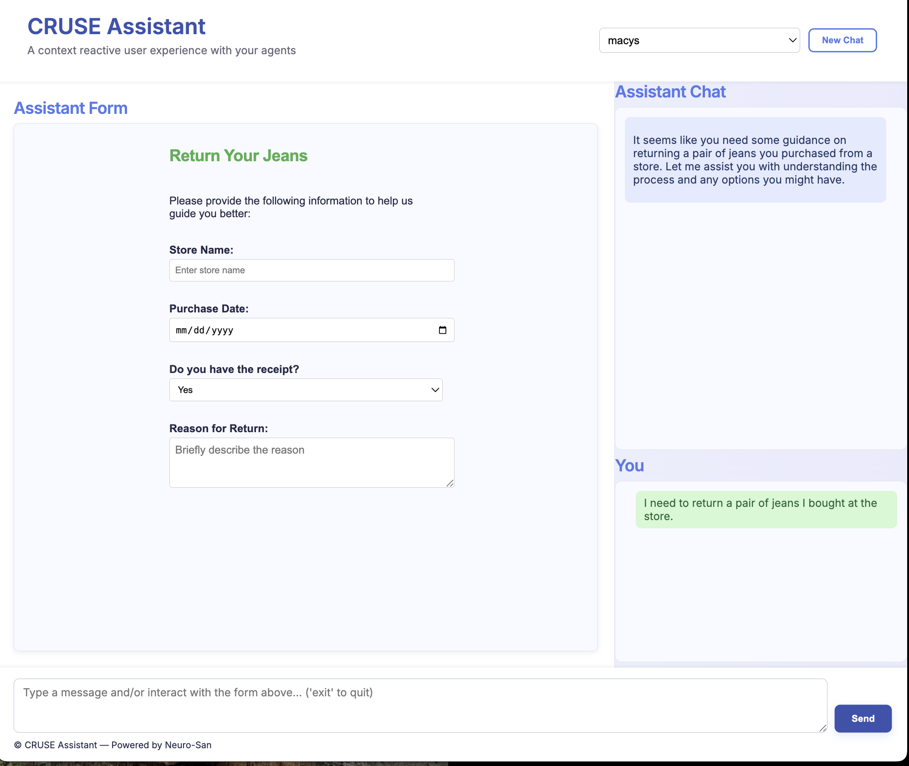

# CRUSE

**CRUSE** is an agentic interface that uses the principles of Context Reactive User Experience and is called from the [cruse_assistant.py]
(../../apps/cruse/cruse_assistant.py) Flask app.

---

## File

[cruse_agent.hocon](../../registries/cruse_agent.hocon)

---

## Prerequisites

- This agent is **disabled by default**. To test it:
    - Manually enable it in the `manifest.hocon` file.
    - Make sure to install the requirements for this app using the following command:
    `pip install -r apps/cruse/requirements.txt`
    - run the application with the command:`python -m apps.cruse.interface_flask

---

## Description

A Context Reactive User Experience [CRUSE](https://dl.acm.org/doi/abs/10.1145/1234161.1234181) is one where the intent of
the user is determined by the context of their interactions with the user interface at the time of issuing a command. For
instance, if a user points at the image of a dog and says, “find me more!” the system should know that the user means they
want it to find more images of dogs. The elements of the interface are also dynamically generated based what the system
considers to be the most natural way to interact with the user. For example, rather than asking the user, “would you like
me to search more the word ‘dog’, images of dogs, or either?” the system would produce a radio button with the three choices
so the user can easily click on their choice.

Once you run the [interface_flask.py](../../apps/cruse/interface_flask.py) Flask app, it will provide you with a link,
which you can open in your browser to play around with the cruse assistant. This assistant can attached to any existing
agent network in your `registries.manifest.hocon` file and make it operate with a context reactive user experience.

The hocon file includes an example of calling a coded_tool that makes calls to an agent defined in sly_data. Note how the
session information is stored and retrieved from the sly_data too.

---

## Examples

CRUSE automatically generates a form:

The user only submits the form with no chat:

Some other examples:

