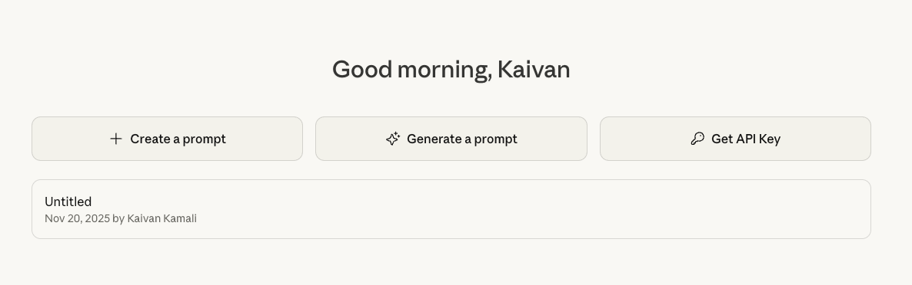
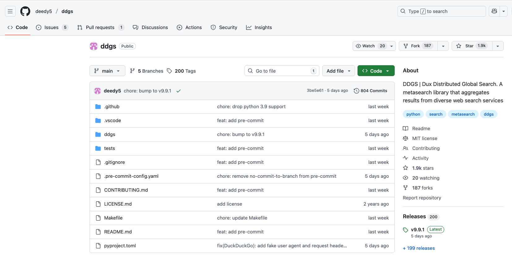
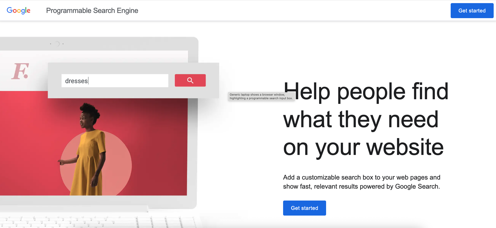
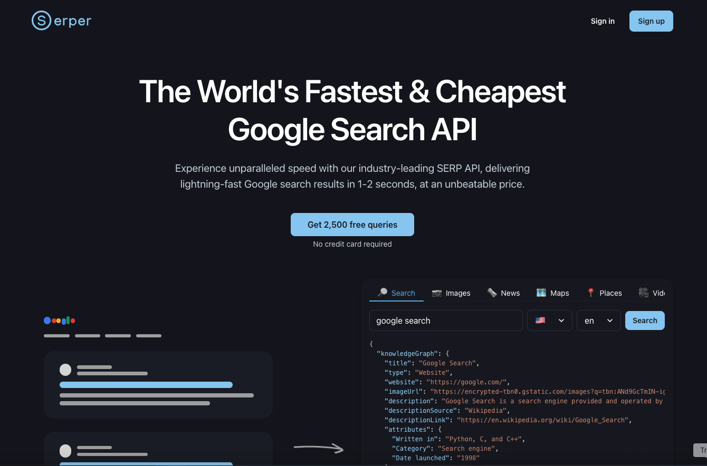
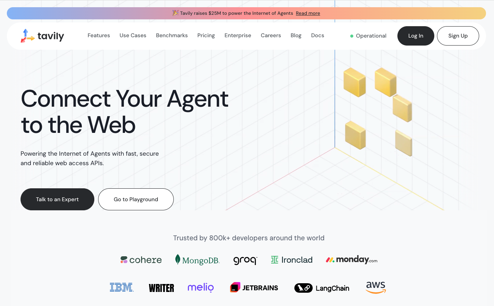

# Neuro SAN Search Tools

Neuro SAN offers search capability via the following search engines:

1. anthropic\_search — Web search via Anthropic's search tool
2. brave\_search — Search using Brave Search API
3. ddgs\_search — Search using DuckDuckGo (no API key required)
4. google\_search — Search using Google Custom Search Engine
5. google\_serper — Search using Google Serper API with advanced filtering
6. openai\_search — Web search via OpenAI's search tool
7. tavily\_search — AI-optimized search using Tavily API

In this document, we will go over each search tools listed above and will also do a comparison.

## Anthropic Search

Anthropic Search is the built-in web search system used by Claude, designed to let the model access fresh, real-time
information from the internet in a safe, transparent way. It is not a standalone public product (like Google or Bing).
Instead, it is a search layer integrated into Claude, combining multiple web search APIs (E.g., Brave, depending on
partnership and availability).

_Environment Variables:_

Get an API key by visiting [https://console.anthropic.com/settings/keys](https://console.anthropic.com/settings/keys).
Once you have the API key, set it using the `ANTHROPIC_API_KEY` environment variable. You must also have
langchain-anthropic>=0.3.13 installed in your virtual environment.

_Example Usage in Neuro San Studio_:

<!-- pyml disable line-length -->
[anthropic\_web_search.hocon](https://github.com/cognizant-ai-lab/neuro-san-studio/blob/main/coded_tools/tools/anthropic_web_search.py),
available as a tool in [toolbox\_info.hocon](https://github.com/cognizant-ai-lab/neuro-san-studio/blob/main/toolbox/toolbox_info.hocon)
<!-- pyml enable line-length -->

## Brave Search

Brave Search is an independent, privacy-focused search engine developed by Brave Software, Inc., that uses its own
web index rather than relying on Google or Bing. It does not profile users, meaning it does not collect or store
personal data to track activity.

_Environment Variables:_

To use Brave Search in your agent network, you must obtain an API key from
[https://brave.com/search/api/](https://brave.com/search/api/). Once you have the API key, set it using the
`BRAVE_API_KEY` environment variable.

The Brave search URL is specified via `BRAVE_URL` environment variable. If `BRAVE_URL` is not set, the
default value listed below is used:

[https://api.search.brave.com/res/v1/web/search?q=](https://api.search.brave.com/res/v1/web/search?q=)

Optionally, you can override the default value by setting `BRAVE_URL` environment variable (E.g., if you're running
a self-hosted Brave Search API clone, or if you want to Switch to a different search engine, like DuckDuckGo). You
can also configure the request timeout (in seconds) using `BRAVE_TIMEOUT`; the default is 30 seconds.

_Example Usage in Neuro San Studio:_

<!-- pyml disable line-length -->
[brave\_search.hocon](https://github.com/cognizant-ai-lab/neuro-san-studio/blob/main/registries/tools/brave_search.hocon),
[real\_estate.hocon](https://github.com/cognizant-ai-lab/neuro-san-studio/blob/main/registries/real_estate.hocon),
available as a tool in toolbox\_info.hocon](https://github.com/cognizant-ai-lab/neuro-san-studio/blob/main/toolbox/toolbox_info.hocon)
<!-- pyml enable line-length -->

## Dux Distributed Global Search (DDGS)

Dux Distributed Global Search (DDGS) is a Python open-source library that acts as a metasearch tool, aggregating
and ranking search results from multiple web search engines, like Google and Brave, to provide a diverse set of
results. It was originally called duckduckgo\_search but was expanded to support a variety of search backends.

DDGS requires no API key, even though it may search Brave or Google. That is because DDGS scrapes public search
result pages and avoids official API endpoints (which require keys). For example, no Google API key needed, because
it does not call

[https://customsearch.googleapis.com/](https://customsearch.googleapis.com/)

Instead, it scrapes:

[https://www.google.com/search?q=<query](https://www.google.com/search?q=<query)\>

_Example Usage in Neuro San Studio_:

[ddgs_search.hocon](https://github.com/cognizant-ai-lab/neuro-san-studio/blob/main/registries/tools/ddgs_search.hocon),
[agent\_netowork\_designer.hocon](https://github.com/cognizant-ai-lab/neuro-san-studio/blob/main/registries/agent_network_designer.hocon),
[agentic\_rag.hocon](https://github.com/cognizant-ai-lab/neuro-san-studio/blob/main/registries/tools/agentic_rag.hocon),
[airbnb.hocon](https://github.com/cognizant-ai-lab/neuro-san-studio/blob/main/registries/airbnb.hocon),
[booking.hocon](https://github.com/cognizant-ai-lab/neuro-san-studio/blob/main/registries/booking.hocon),
[carmax.hocon](https://github.com/cognizant-ai-lab/neuro-san-studio/blob/main/registries/carmax.hocon),
[expedia.hocon](https://github.com/cognizant-ai-lab/neuro-san-studio/blob/main/registries/expedia.hocon),
[LinkedInJobSeekerSupportNetwork.hocon](https://github.com/cognizant-ai-lab/neuro-san-studio/blob/main/registries/LinkedInJobSeekerSupportNetwork.hocon),
available as a tool in
[toolbox\_info.hocon](https://github.com/cognizant-ai-lab/neuro-san-studio/blob/main/toolbox/toolbox_info.hocon)

## Google Custom Search Engine

Google Custom Search Engine (CSE) -- now called Programmable Search Engine -- is a service from Google that lets you
create your **own search engine** that searches only **specific sites**, or a controlled slice of the web, with
optional customization and API access. It’s commonly used in websites, apps, and research tools.

_Environment Variables_:

To use this search tool, you must

1. Create a Custom Search Engine (CSE)  
   * Go to [https://programmablesearchengine.google.com/](https://programmablesearchengine.google.com/)
   * Click "Add" → Choose sites or use "\*" to search the whole web  
   * Note your Search Engine ID (cx).  
2. Get Google API key  
   * Go to: [https://console.cloud.google.com/](https://console.cloud.google.com/)
   * Enable the Custom Search API.  
   * Create an API key under APIs & Services > Credentials.  
3. Use the CSE ID in step 1 to set `GOOGLE_SEARCH_CSE_ID` environment variable.  
4. Use the API key in step 2 to set `GOOGLE_SEARCH_API_KEY` environment variable.
5. You can optionally set a custom search URL and a custom timeout via the `GOOGLE_SEARCH_URL` and
`GOOGLE_SEARCH_TIMEOUT` environment variables. Otherwise, the default values of
[https://www.googleapis.com/customsearch/v1](https://www.googleapis.com/customsearch/v1) and `30` are used.

_Example Usage in Neuro San Studio_:

<!-- pyml disable line-length -->
[google\_search.hocon](https://github.com/cognizant-ai-lab/neuro-san-studio/blob/main/registries/tools/google_search.hocon),
available as a tool in [toolbox\_info.hocon](https://github.com/cognizant-ai-lab/neuro-san-studio/blob/main/toolbox/toolbox_info.hocon)
<!-- pyml enable line-length -->

## Google Serper

Google Serper (serper.dev) is a third-party Google Search API service that gives developers programmatic access to
real Google Search results in JSON format. It exists because Google does NOT provide an official full-web Search API,
and scraping Google yourself is difficult, unstable, and often blocked. Serper solves that by doing the scraping on
your behalf and returning clean, structured results.

_Environment Variables:_

To use this search tool, obtain an API key from: [https://serper.dev/](https://serper.dev/). Once you have the API
key, set it using the SERPER\_API\_KEY environment variable.

_Example Usage in Neuro San Studio_:

Available as a tool in [toolbox\_info.hocon](https://github.com/cognizant-ai-lab/neuro-san-studio/blob/main/toolbox/toolbox_info.hocon)

## OpenAI Search

OpenAI Search is the built-in web search system used by ChatGPT. It is not a standalone search engine like Google/Bing,
nor a public “OpenAI Search API”. It is an internal retrieval system that lets ChatGPT access fresh, real-time
information from the internet when you ask it to “search the web”. It’s not publicly confirmed exactly which
underlying search engine OpenAI uses for all of its web-search features.

_Environment Variables:_

To use this search tool, obtain an API key from:
[https://platform.openai.com/api-keys](https://platform.openai.com/api-keys). Once you have the API key, set it using
the `OPENAI_API_KEY` environment variable. You must also have langchain-openai >= 0.3.26 installed in your
virtual environment.

_Example Usage in Neuro San Studio:_

<!-- pyml disable line-length -->
[openai\_web\_search.hocon](https://github.com/cognizant-ai-lab/neuro-san-studio/blob/main/registries/tools/openai_web_search.hocon),
available as a tool in [toolbox\_info.hocon](https://github.com/cognizant-ai-lab/neuro-san-studio/blob/main/toolbox/toolbox_info.hocon)
<!-- pyml enable line-length -->

## Tavily Search

Tavily Search is a developer-focused search API designed specifically for LLMs, AI agents, and automation. It is
not a traditional search engine like Google or Bing; instead, it is a purpose-built retrieval system optimized for
fast, cheap, reliable, LLM-friendly search. It’s one of the most popular search solutions in the AI ecosystem
(used in LangChain, LlamaIndex, etc.).

_Environment Variables:_

To use this search tool, obtain an API key from: [https://www.tavily.com/](https://www.tavily.com/). Once you have
the API key, set it using the TAVILY\_API\_KEY environment variable. You must also have langchain-tavily installed
in your virtual environment.

_Example Usage in Neuro San Studio_:

Available as a tool in [toolbox\_info.hocon](https://github.com/cognizant-ai-lab/neuro-san-studio/blob/main/toolbox/toolbox_info.hocon)

## Comparison of Search Tools

<!-- pyml disable no-inline-html -->
<!-- pyml disable line-length -->
| Search Tool | What It Is | Search Engine? | Data Source / Index | Public API ? |
| --- | --- | --- | --- | --- |
| Anthropic | built-in web search system used by Claude | No | Uses external APIs (e.g., Bing, Brave) | No |
| Brave | Privacy-focused independent search engine | Yes | Own independent index | Yes |
| DDGS | A meta-search library, aggregates results from diverse web search services | No | Scrapes public search result pages from DuckDuckGo, Bing, Brave, Google | No |
| Google | Lets you build a search engine tailored to specific websites or topics | Yes | Google’s index (simpler ranking, limited personalization) | Yes |
| Serper | Third-party Google Search API service that scrapes Google Search results in JSON format | No | Real Google Search results via scraping | Yes |
| OpenAI | Built-in web search system used by ChatGP | No | Uses Bing API + other sources | No |
| Tavily | Search API designed specifically for LLMs, AI agents, and automation | No | Mix of search providers + own crawlers + extraction pipeline | Yes |
<!-- pyml enable line-length -->
<!-- pyml enable no-inline-html -->

The cost and rate limit comparison is provided in the table below.

<!-- pyml disable no-inline-html -->
<!-- pyml disable line-length -->
| Search Tool | Free Tier | Paid Tier(s) |
| --- | --- | --- |
| Anthropic Search | Yes  (Internal to Claude) Check Anthropic rate limits | Yes  (Internal to Claude) Check Anthropic rate limits |
| Brave Search | Yes  1 request/second 2,000 request /month | Base AI: $5 per 1,000 requests 20 requests/second 20 million queries/month Pro AI: $9 per 1,000 requests 50 requests/second Unlimited queries/month |
| DDGS | Yes Rate limit: backend specific | No |
| Google Search | Yes 100 searches/day | Yes $5 for 1,000 queries 10,000 queries/day |
| Google Serper | Yes 2,500 queries (one-time) | Yes $50, 50k queries, 50 queries/sec |
| OpenAI Search | Yes (Internal to ChatGPT) Check OpenAI rate limits | Yes (Internal to ChatGPT) Check OpenAI rate limits |
| Tavily Search | Yes 1,000 API credits/month | Yes Pay-as-you-go: $0.008 per credit Monthly plans: $0.0075 - $0.005 per credit |
<!-- pyml enable line-length -->
<!-- pyml enable no-inline-html -->

Below please find links for cost and rate limit comparison data:

<!-- pyml disable line-length -->
1. [Brave Search](https://brave.com/search/api/)
2. [Google Search](https://support.google.com/programmable-search/answer/9069107?hl=en)
3. [Google Serper](https://serper.dev/)
4. [Tavily Search](https://www.tavily.com/#pricing)
<!-- pyml enable line-length -->
