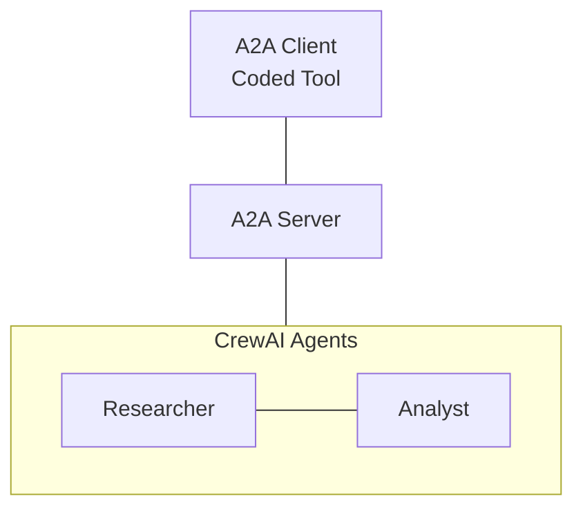

# CrewAI A2A Research Report Agent

A research report generation system using CrewAI agents integrated with the A2A (Agent-to-Agent) protocol. This project demonstrates how to connect agents from another framework with Neuro-SAN using A2A protocal.

## Overview

This system consists of:
- **A2A Server**: Hosts CrewAI agents that perform research and generate reports
- **A2A Client**: Coded tool that connects to the server to request research reports
- **CrewAI Agents**: Two specialized agents working together - a researcher and a reporting analyst

## Architecture



## Installation

### Dependencies

```bash
pip install a2a-sdk crewai
```

## Usage

### 1. Start the A2A Server

```bash
python server.py --host localhost --port 9999
```

The server will:
- Initialize CrewAI agents (researcher and reporting analyst)
- Set up A2A protocol endpoints
- Listen for research requests

### 2. Turn on the agent network

- Go to registries/manifest.hocon
- Find `a2a_research_report.hocn` and change its value to `true`

### 3. Run Nsflow

nsflow is a developer-oriented web client. From the root of the repo, run the command:

```bash
python -m run
```

and select `a2a_research_report`

## Disclaimer

This code is provided as a sample and is **not production-ready**.  
It is intended solely for demonstration purposes, showing how to connect to another framework using the Agent-to-Agent (A2A) protocol.  

For more details, please refer to the official documentation and references.

## References

- [A2A Protocol Specification](https://google.github.io/A2A/specification)
- [CrewAI Documentation](https://docs.crewai.com/)
- [A2A Python SDK](https://github.com/google/a2a-python)
